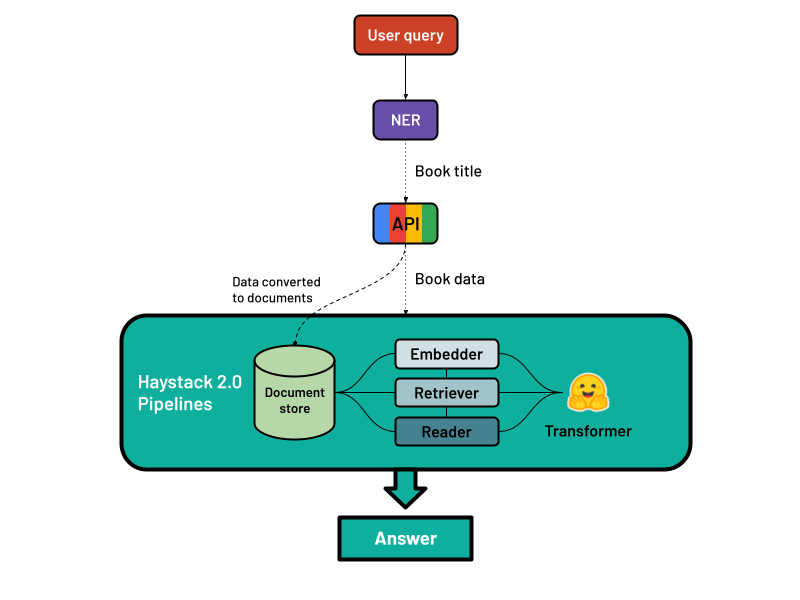

# AI-Powered Book Question-Answering and Recommendation System

## Overview

This project focuses on developing an AI system to effectively respond to queries about books and recommend relevant titles. It aims to:
- **Develop an AI-powered Book Question-Answering System:** Utilize natural language processing (NLP) and machine learning techniques to build a robust system capable of understanding and answering questions related to books.
- **Create a Book Recommendation System:** Design a system that suggests books based on their similarity to other titles, leveraging modern NLP and machine learning techniques.

## Methodology

- **Named Entity Recognition (NER):** Implemented to identify book titles in queries.
- **Data Collection:** The data collection process involved curating a bestseller dataset to train Named Entity Recognition (NER) models for accurate book title identification and utilizing the Google Books API for real-time data collection and implementation of the question-answering system. This approach enabled both the accurate classification of book titles and the retrieval of comprehensive book information for enhanced system performance.
- **Information Retrieval-based Question-Answering:** Utilized the Haystack framework to build an extractive QA system. Components include document stores, embedders, retrievers, readers, and pipelines.
  

- **Book Recommendation System:** Developed using both cosine similarity and transformer-based approaches to suggest relevant books based on metadata and user preferences.

## Implementation

- **AI Assistant:** Demonstrated the AI-powered book question-answering system with integrated recommendation features.
  
- **Integrated Recommendation System:** Implemented to propose relevant book recommendations based on the analyzed data.
  
- **Model Evaluation:** Evaluated the performance of both the question-answering and recommendation systems to ensure accuracy and relevance.

## Evaluation

### Model Comparison

The table below presents the evaluation results for both models:

| Feature                          | Custom NER Model | Baseline NER Model |
|----------------------------------|------------------|--------------------|
| Entity Recognition                | ✔                | ✔                  |
| Fine-tuned on Book Labels         | ✔                | ✘                  |
| Accuracy                          | 0.98             | 0.05               |
| F1 Score                           | 0.96             | 0.03               |
| Semantic Evaluation Score         | 0.96             | 0.533              |

### Recommendation Approaches

The following table provides a comprehensive comparative evaluation for the two recommendation approaches tested on 10 different reference books:

| Metric                           | Traditional Cosine Similarity Approach | Transformer Based Approach |
|----------------------------------|----------------------------------------|----------------------------|
| Average Similarity Score          | 11%                                    | 44%                        |
| Recommendation Relevance Score    | 49%                                    | 68%                        |
| Overlapping Recommendations       | 15%                                    | 44%                        |

## Conclusions

This project demonstrated the effectiveness of integrating advanced NLP techniques, such as Haystack 2.0 and Hugging Face transformers, to develop a sophisticated AI system for book-related queries. By combining information retrieval and Named Entity Recognition, we created an intelligent question-answering system enhanced with a book recommendation engine. The system successfully provided accurate responses and personalized recommendations, showcasing the power of modern AI frameworks. Key contributions include a robust QA system and an advanced recommendation engine, both of which highlight the potential for future improvements and adaptations in intelligent AI systems. The research underscores the importance of leveraging cutting-edge technologies and sets a foundation for further advancements in building effective and scalable AI solutions.
